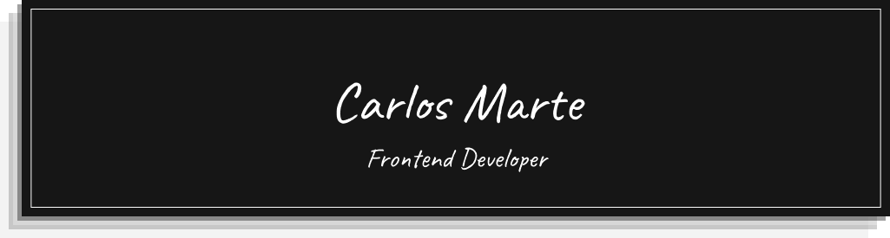

<!-- Banner -->

<!-- Por cambiar -->

Un desarrollador amante del Hardware. Intentado mejorar cada día.

##

 

<!-- Habilidades -->
## :books: Mis Habilidades
 

:pushpin: **Lenguajes de programación**

 
    <!-- JAVA ICON -->
    <!---->
    <!-- JS ICON -->
     

:pushpin: **Desarrollo Front-end**

 
    <!-- HTML ICON -->
    
    <!-- CSS3 ICON -->
    
    <!-- SASS ICON -->
    

:pushpin: **Software & Herramientas**

 
    <!-- GIT ICON -->
    

:pushpin: **Base de datos**

 
    <!-- MySQL ICON -->
    

 

<!-- Stats -->

## 📊 GitHub Stats

